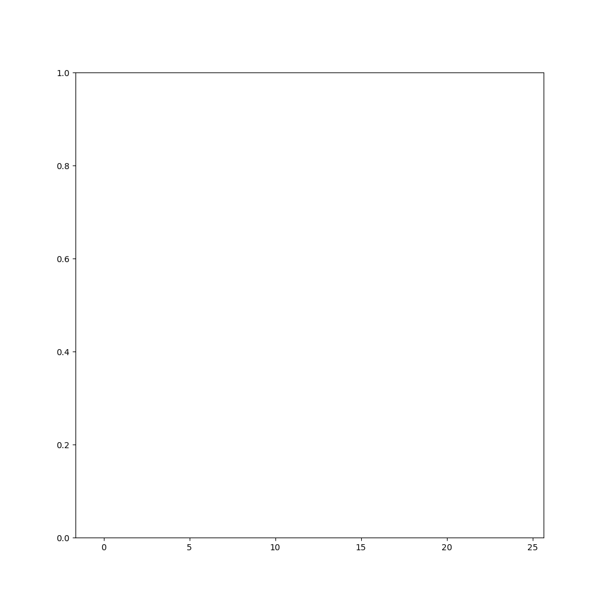

# Week 2 - Markov Localization
---

## Navigation

My `motion_model()` is implemented in `markov_localizer.py` , `Line 41 ~ 62'   
I alse implemented my `observation_model()` at `Line 65 ~ 107'   

I made some annotations with code as my report.   

Below shows my Markov localizer works well.

---

## Assignment

You will complete the implementation of a simple Markov localizer by writing the following two functions in `markov_localizer.py`:

* `motion_model()`: For each possible prior positions, calculate the probability that the vehicle will move to the position specified by `position` given as input.
* `observation_model()`: Given the `observations`, calculate the probability of this measurement being observed using `pseudo_ranges`.

The algorithm is presented and explained in class.

All the other source files (`main.py` and `helper.py`) should be left as they are.

If you correctly implement the above functions, you expect to see a plot similar to the following:

If you run the program (`main.py`) without any modification to the code, it will generate only the frame of the above plot because all probabilities returned by `motion_model()` are zero by default.