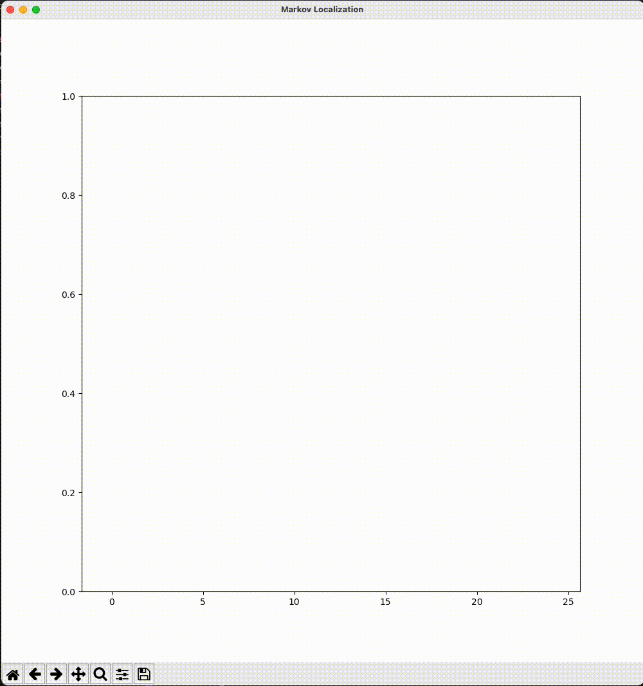

# Week 2 - Markov Localization
---

## Report

### `motion_model()`
- motion model은 `markov_localizer.py`의 `Line 41 ~ 62`에 구현하였다.   
- 가능한 모든 이전 위치에 대하여 차량이 이동할 위치의 확률을 반환한다. 

- 예측 확률은 `transition probability`와 `prior probability`를 곱하여 계산하는데, `transition probability`는 정규분포를 따른다고 가정한다.   
- map을 벗어나지 않고 직전 위치에서 이동 가능한 위치까지의 거리를 구하고, `helper.py`의 - `norm_pdf()` 함수를 사용하여 `transition probability`를 계산한다.  -- `Line 55 ~ 58`   
이 확률을 `prior probability`와 곱한 값을 모두 더하면 현재 상태의 위치에 대한 예측 확률이 계산된다. -- `Line 60`   

### `observation_model()`
- motion model은 `markov_localizer.py`의 `Line 65 ~ 98`에 구현하였다.   
- 주어진 관측(`observations`)에 대하여 이 관측의 정확도를 확률로 계산한다.   

- 관측이 주어지지 않았거나, 관측이 `pseudo_ranges`보다 많은 경우는 불가능하므로, 확률을 0으로 설정한다. -- `Line 92 ~ 96`   
- 이외의 경우, 관측과 `pseudo_range`를 pair로 하여 정규분포 상의 확률을 계산하고 모두 곱하여 반환한다. -- `Line 82 ~ 90`

### Result
위에서 구현한 Markov Localizer의 동작은 아래와 같다.

---

## Assignment

You will complete the implementation of a simple Markov localizer by writing the following two functions in `markov_localizer.py`:

* `motion_model()`: For each possible prior positions, calculate the probability that the vehicle will move to the position specified by `position` given as input.
* `observation_model()`: Given the `observations`, calculate the probability of this measurement being observed using `pseudo_ranges`.

The algorithm is presented and explained in class.

All the other source files (`main.py` and `helper.py`) should be left as they are.

If you correctly implement the above functions, you expect to see a plot similar to the following:

If you run the program (`main.py`) without any modification to the code, it will generate only the frame of the above plot because all probabilities returned by `motion_model()` are zero by default.