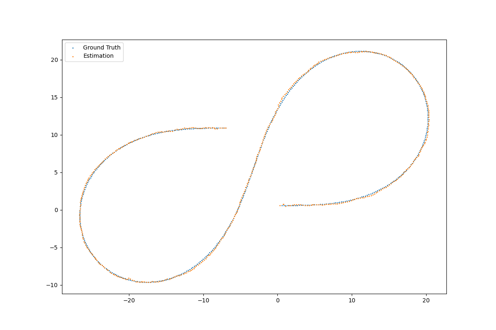

# Week 3 - Kalman Filters, EKF and Sensor Fusion

---

## Report

### `update_ekf()`
- `update_ekf()`는 `kalman_filter.py`의 `Line 29 ~ 70`에 구현하였다.   
- radar measurements를 활용하여 `Extended Kalman Filter`를 update한다.    

- 아래와 같은 순서를 따르며, 반복을 통해 매 time step마다 예측을 갱신한다.   

1. Compute Jacobian Matrix H_j -- `Line 43`   
   - `tools.py`의 `Jacobian()` 함수를 사용하여 state variable의 Jacobain 행렬을 구한다.  
2. Calculate S = H_j * P' * H_j^T + R -- `Line 47`  
   - Kalman Gain K를 계산하기 위해 중간 계산을 수행한다.     
3. Calculate Kalman gain K = H_j * P' * Hj^T + R -- `Line 48`   
   - 위에서 구한 값들을 사용하여 Kalman Gain K를 계산한다.   
4. Estimate y = z - h(x')   -- `Line 51 ~ 61`
   - measurement 변수 z와 예측한 state variable로부터 구한 measurement 값의 차이를 계산한다.   
5. Normalize phi so that it is between -PI and +PI -- `Line 64` 
   - 라디안 각도 phi가 -PI와 +PI 사이의 값을 가지도록 normalize한다.
   - 이를 위해 `tools.py`에 `normalize()` 함수를 구현하였다. -- `Line 26 @ tools.py`
6. Calculate new estimates
   - K, y 및 x를 사용하여 새로운 예측 x를 업데이트한다.
   - P, K, H_j를 사용하여 새로운 예측 공분산 P를 계산한다.

### Result
위에서 구현한 `Extended Kalman Filter`의 동작은 아래와 같다.



---


[//]: # (Image References)
[kalman-result]: ./kalman_filter/graph.png
[EKF-results]: ./EKF/plot.png

## Kalman Filter Example

In directory [`./kalman_filter`](./kalman_filter), a sample program for a small-scale demonstration of a Kalman filter is provided. Run the following command to test:

```
$ python testKalman.py
```

This program consists of four modules:

* `testKalman.py` is the module you want to run; it initializes a simple Kalman filter and estimates the position and velocity of an object that is assumed to move at a constant speed (but with measurement error).
* `kalman.py` implements a basic Kalman fitler as described in class.
* `plot.py` generates a plot in the format shown below.
* `data.py` provides measurement and ground truth data used in the example.

The result of running this program with test input data is illustrated below:

![Testing of Kalman Filter Example][kalman-result]

Interpretation of the above results is given in the lecture.

In addition, you can run `inputgen.py` to generate your own sample data. It will be interesting to experiment with a number of data sets with different characteristics (mainly in terms of variance, i.e., noise, involved in control and measurement).

---

## Assignment - EFK & Sensor Fusion Example

In directory [`./EKF`](./EKF), template code is provided for a simple implementation of EKF (extended Kalman filter) with sensor fusion. Run the following command to test:

```
$ python run.py
```

The program consists of five modules:

* `run.py` is the modele you want to run. It reads the input data from a text file ([data.txt](./EKF/data.txt)) and feed them to the filter; after execution summarizes the result using a 2D plot.
* `sensor_fusion.py` processees measurements by (1) adjusting the state transition matrix according to the time elapsed since the last measuremenet, and (2) setting up the process noise covariance matrix for prediction; selectively calls updated based on the measurement type (lidar or radar).
* `kalman_filter.py` implements prediction and update algorithm for EKF. All the other parts are already written, while completing `update_ekf()` is left for assignment. See below.
* `tools.py` provides a function `Jacobian()` to calculate the Jacobian matrix needed in our filter's update algorithm.
*  `plot.py` creates a 2D plot comparing the ground truth against our estimation. The following figure illustrates an example:

![Testing of EKF with Sensor Fusion][EKF-results]

### Assignment

Complete the implementation of EKF with sensor fusion by writing the function `update_ekf()` in the module `kalman_filter`. Details are given in class and instructions are included in comments.
