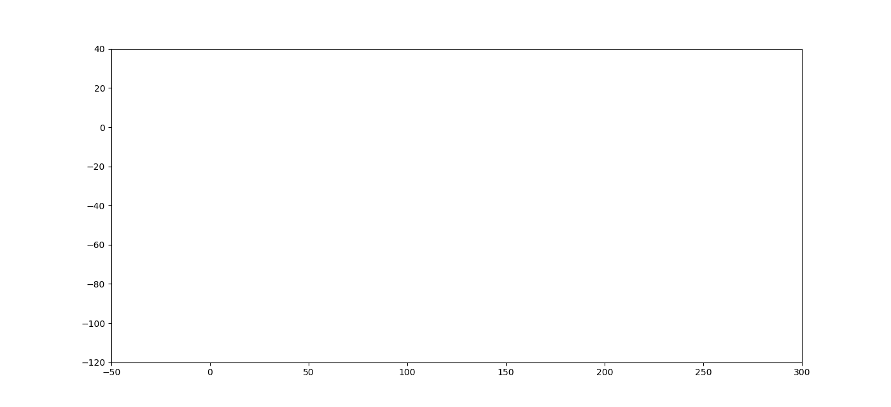

# Week 4 - Motion Model & Particle Filters

---

## Report

### `update_weights()`
- `update_weights()`는 `particle_filter.py`의 `Line 75 ~ 128`에 구현하였다.   
- 각 파티클에 대해 multi-variate Gaussian distribution을 가정하고 observation에 대한 확률을 계산한다.    

- 아래와 같은 순서를 따라 각 파티클의 weight를 업데이트 한다.
1. Select the set of landmarks that are visible (within the sensor range). -- `Line 90 ~ 93`
   - 각 파티클에 대해 `map_data.txt` 파일을 읽은 map에 표시된 landmark들과의 Euclidian 거리를 계산한다.
   - 거리가 `sensor_range`보다 작으면 `visibles`라는 list에 dictionary 형태로 `id_`와 `x`, `y` 값을 저장한다.
2. Transform each observed landmark's coordinates from the particle's coordinate system to the map's coordinates. -- `Line 97~101`
   - Map coordinates에서 Car의 각도를 활용하여 `observations`의 좌표를 Map coordinates로 변환한다.
3 & 4. Associate each transformed observation to one of the predicted (selected in Step 1) landmark positions.    
Update the particle's weight by the calculated probability. -- `Line 115 ~ 128`   
   - `associate()` 함수를 사용하여 예측과 관측을 매칭하여 반환한다.
   - 각각의 매칭과 파티클의 확률을 multi-variate Gaussian distribution 기반으로 계산하고 파티클의 weight를 업데이트 한다.  

### `resample()`
- `update_weights()`는 `particle_filter.py`의 `Line 132 ~ 158`에 구현하였다.   
- weights를 기반으로 샘플링하여 posterior belief를 나타내는 particle set을 재구성한다.

- Low Variance Sampling 방법으로 함수를 구현하였다.


### Result
위에서 구현한 `Extended Kalman Filter`의 동작은 아래와 같다.   
   



---

[//]: # (Image References)
[empty-update]: ./empty-update.gif
[example]: ./example.gif

## Assignment

You will complete the implementation of a simple particle filter by writing the following two methods of `class ParticleFilter` defined in `particle_filter.py`:

* `update_weights()`: For each particle in the sample set, calculate the probability of the set of observations based on a multi-variate Gaussian distribution.
* `resample()`: Reconstruct the set of particles that capture the posterior belief distribution by drawing samples according to the weights.

To run the program (which generates a 2D plot), execute the following command:

```
$ python run.py
```

Without any modification to the code, you will see a resulting plot like the one below:

![Particle Filter without Proper Update & Resample][empty-update]

while a reasonable implementation of the above mentioned methods (assignments) will give you something like

![Particle Filter Example][example]

Carefully read comments in the two method bodies and write Python code that does the job.
