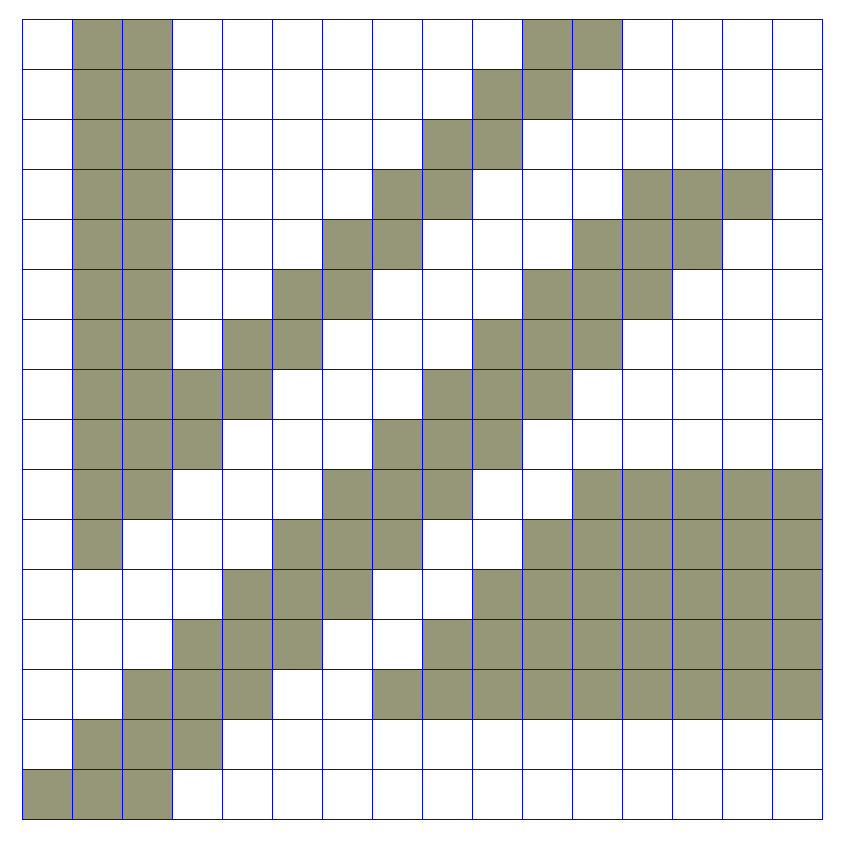
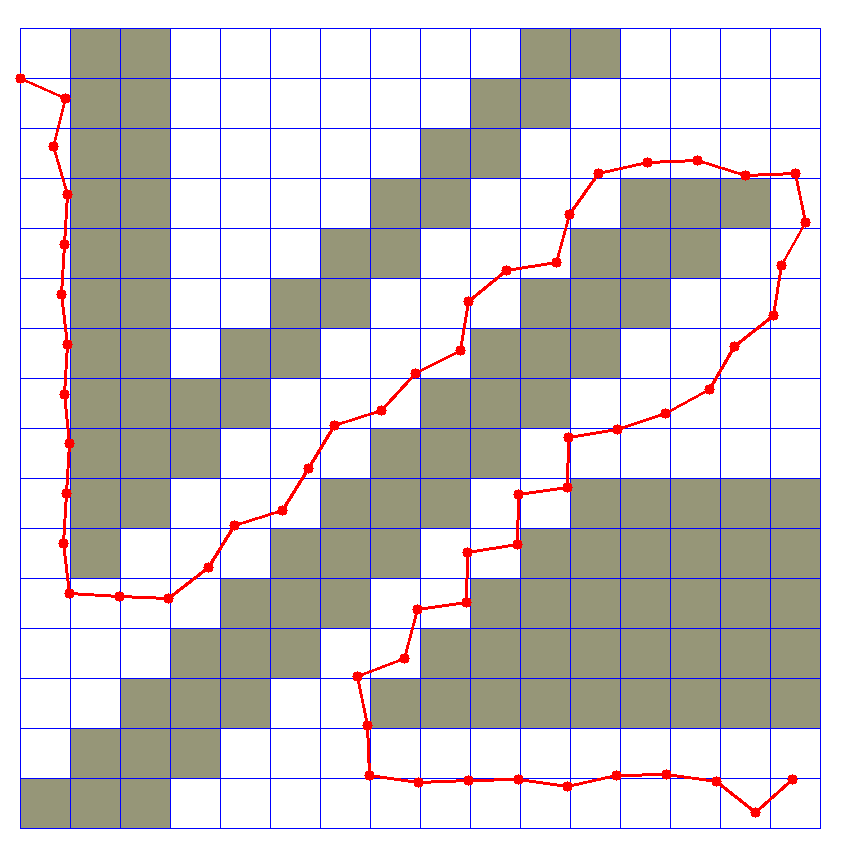
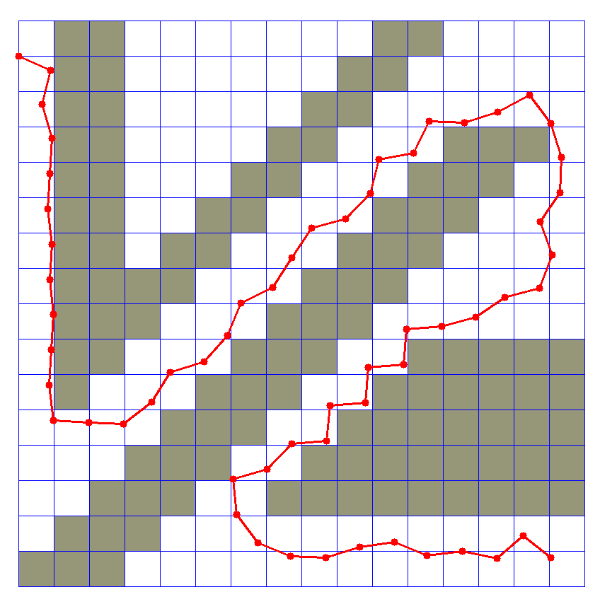

# Week 7 - Hybrid A* Algorithm & Trajectory Generation

---
## Report 
* 이번 과제는 Hybrid A* 알고리즘을 구현하는 것이다.
* `HybridAstar`의 4가지 method를 구현해야 하는데, 하나씩 살펴보면 다음과 같다.

---
* `heuristic()` : Line 150 ~ 153 in 
* 이 함수는 Hybrid A* 알고리즘에서 사용하는 heuristic 함수를 나타낸다.
```python
def heuristic(self, x, y, goal):
        L1_dist = abs(goal[0]-x) + abs(goal[1]-y)
        return L1_dist
```
* L1 distance를 heuristic 함수로 사용하였다.
---
* `theta_to_stack_num()` : Line 132 ~ 142 in 
* 이 함수는 `theta`가 주어졌을 때, 그 `theta`가 해당하는 stack의 숫자를 반환한다.
```python
    def theta_to_stack_num(self, theta):
        deg = theta * 180 / np.pi
        interval = 360 / self.NUM_THETA_CELLS
        stack_num = deg // interval 
        stack_num = stack_num if not stack_num == self.NUM_THETA_CELLS else 0
        
        return int(stack_num)
```
* radian 단위의 `theta`를 degree 단위로 변환하여 `deg`를 계산한다.
* 전체 360 degree를 `self.NUM_THETA_CELLS`로 나누어 한 stack의 `interval`을 구한다.
* `deg`를 `interval`로 나누고 몫만 취하면 구하고자 하는 `stack_num`이 된다.
* index Error를 방지하기 위해 `stack_num`이 `self.NUM_THETA_CELLS`과 같다면 0으로 변환한다.
---
* `expand()` : Line 33 ~ 59 in 
* 이 함수는 bicycle model을 가정하고 현재 상태에서 가능한 next state들을 반환한다.
```python
    def expand(self, current, goal):
        g = current['g']
        x, y, theta = current['x'], current['y'], current['t']

        # The g value of a newly expanded cell increases by 1 from the
        # previously expanded cell.
        g2 = g + 1
        next_states = []

        for delta_t in range(self.omega_min, self.omega_max + 1, self.omega_step):
            omega = self.speed / self.length * np.tan(np.deg2rad(delta_t))
            next_x = x + self.speed * np.cos(theta)
            next_y = y + self.speed * np.sin(theta)
            next_theta = (theta + omega) % (2*np.pi)
            
            if 0 <= self.idx(next_x) < self.dim[1] and 0 <= self.idx(next_y) < self.dim[2]:
                next_f = g2 + self.heuristic(next_x, next_y, goal)
                next_state = self.State(next_x, next_y, next_theta, g2, next_f)
                next_states.append(next_state)
            
        return next_states
```
* `omega_min`부터 `omega_max`까지 `omega_step` 간격으로 나눈 각도에 대해서 아래를 진행한다.
* bicycle model에 따라 `omega`, 다음 스텝의 `next_x`, `next_y`, `next_theta`를 계산한다.
* `next_theta`는 정규화하여 [0, 2*PI)의 범위에 있도록 한다.
* 새로운 (x, y)가 맵 안의 지점이라면 `next_f`를 계산하여 `next_state`를 구한 후, `next_states` list에 추가하여 반환한다.
---
* `search()` : Line 63 ~ 128 in 
* 이 함수는 breadth-first search를 진행한다. 
```python
while len(opened) > 0:
            # TODO: implement prioritized breadth-first search
            # for the hybrid A* algorithm.
            opened.sort(key=lambda s : s['f'], reverse=True)
            curr = opened.pop()
            x, y = curr['x'], curr['y']
            if (self.idx(x), self.idx(y)) == goal:
                self.final = curr
                found = True
                break

            next_states = self.expand(curr, goal)
            for n in next_states:
                idx_x, idx_y = self.idx(n['x']), self.idx(n['y'])
                stack = self.theta_to_stack_num(n['t'])

                if grid[idx_x, idx_y] == 0:
                    dist_x, dist_y = abs(self.idx(x) - idx_x), abs(self.idx(y) - idx_y)
                    min_x, min_y = min(self.idx(x), idx_x), min(self.idx(y), idx_y)
                    possible = True
                    for d_x in range(dist_x + 1):
                        for d_y in range(dist_y + 1):
                            if grid[min_x + d_x, min_y + d_y] != 0:
                                possible = False
                    if possible and self.closed[stack][idx_x][idx_y] == 0:
                        self.closed[stack][idx_x][idx_y] = 1
                        total_closed += 1
                        self.came_from[stack][idx_x][idx_y] = curr
                        opened.append(n)
```
* `opened` list를 f 값으로 정렬하고 `pop()`을 하여 `curr`을 택한다.
* `curr`이 도착지점이면 `self.final`에 저장하고 `found = True`로 설정 후 break.
* `curr`과 `goal`을 입력으로 `expand()`하여 다음 상태 `next_states`를 얻는다.
* `next_states`에 있는 각 다음 상태들에 대하여 맵 상의 갈 수 있는 지점인지 확인한다.
* 갈 수 있는 다음 상태에 대하여 장애물 충돌 여부를 확인하고 충돌이 있어 갈 수 없는 지점이면 `possible = False`로 설정한다.
* `possible`이 True이고 그 지점 및 각도의 `closed`가 0이라면 1로 설정하고 `came_from`에 `curr`을 대입한다.
* `opened`에 해당 상태를 추가하여 while문 반복 진행한다.
---
### Result
아래는 `NUM_THETA_CELLS`와 `speed`를 다르게 했을 때의 실행 결과이다.

* `speed = 0.5`, `NUM_THETA_CELLS = 90`


* `speed = 1.0`, `NUM_THETA_CELLS = 90`


* `speed = 0.5`, `NUM_THETA_CELLS = 180`


* `speed = 1.0`, `NUM_THETA_CELLS = 180`


* `speed = 0.5`, `NUM_THETA_CELLS = 360`


* `speed = 1.0`, `NUM_THETA_CELLS = 360`


---
[//]: # (Image References)
[has-example]: ./hybrid_a_star/has_example.png
[ptg-example]: ./PTG/ptg_example.png

## Assignment: Hybrid A* Algorithm

In directory [`./hybrid_a_star`](./hybrid_a_star), a simple test program for the hybrid A* algorithm is provided. Run the following command to test:

```
$ python main.py
```

The program consists of three modules:

* `main.py` defines the map, start configuration and end configuration. It instantiates a `HybridAStar` object and calls the search method to generate a motion plan.
* `hybrid_astar.py` implements the algorithm.
* `plot.py` provides an OpenCV-based visualization for the purpose of result monitoring.

You have to implement the following sections of code for the assignment:

* Trajectory generation: in the method `HybridAStar.expand()`, a simple one-point trajectory shall be generated based on a basic bicycle model. This is going to be used in expanding 3-D grid cells in the algorithm's search operation.
* Hybrid A* search algorithm: in the method `HybridAStar.search()`, after expanding the states reachable from the current configuration, the algorithm must process each state (i.e., determine the grid cell, check its validity, close the visited cell, and record the path. You will have to write code in the `for n in next_states:` loop.
* Discretization of heading: in the method `HybridAStar.theta_to_stack_num()`, you will write code to map the vehicle's orientation (theta) to a finite set of stack indices.
* Heuristic function: in the method `HybridAStar.heuristic()`, you define a heuristic function that will be used in determining the priority of grid cells to be expanded. For instance, the distance to the goal is a reasonable estimate of each cell's cost.

You are invited to tweak various parameters including the number of stacks (heading discretization granularity) and the vehicle's velocity. It will also be interesting to adjust the grid granularity of the map. The following figure illustrates an example output of the program with the default map given in `main.py` and `NUM_THETA_CELLS = 360` while the vehicle speed is set to 0.5.

![Example Output of the Hybrid A* Test Program][has-example]

---

## Experiment: Polynomial Trajectory Generation

In directory [`./PTG`](./PTG), a sample program is provided that tests polynomial trajectory generation. If you input the following command:

```
$ python evaluate_ptg.py
```

you will see an output such as the following figure.

![Example Output of the Polynomial Trajectory Generator][ptg-example]

Note that the above figure is an example, while the result you get will be different from run to run because of the program's random nature. The program generates a number of perturbed goal configurations, computes a jerk minimizing trajectory for each goal position, and then selects the one with the minimum cost as defined by the cost functions and their combination.

Your job in this experiment is:

1. to understand the polynomial trajectory generation by reading the code already implemented and in place; given a start configuration and a goal configuration, the algorithm computes coefficient values for a quintic polynomial that defines the jerk minimizing trajectory; and
2. to derive an appropriate set of weights applied to the cost functions; the mechanism to calculate the cost for a trajectory and selecting one with the minimum cost is the same as described in the previous (Week 6) lecture.

Experiment by tweaking the relative weight for each cost function. It will also be very interesting to define your own cost metric and implement it using the information associated with trajectories.
